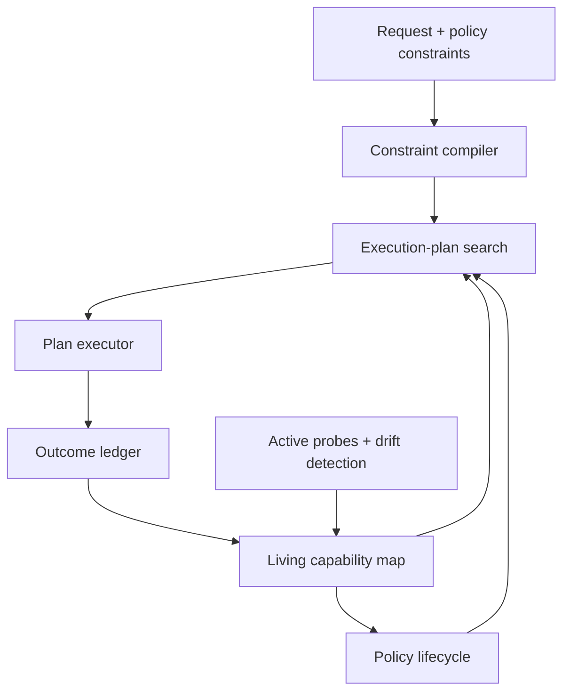
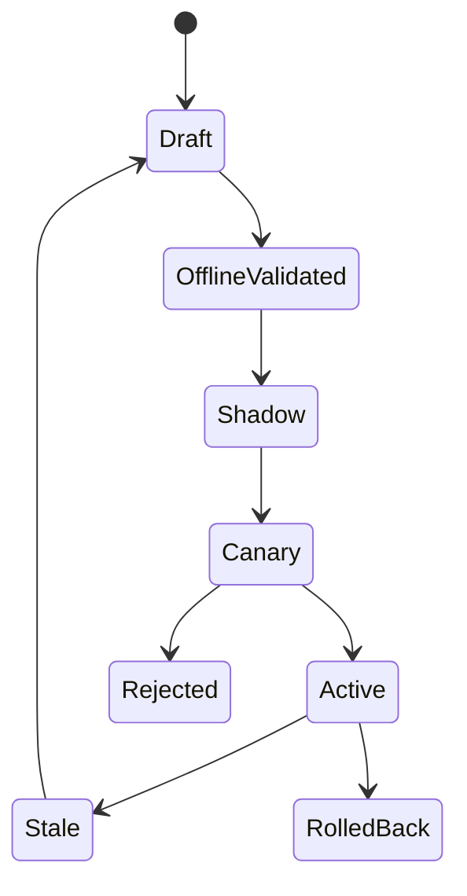

# Next Phase V2 Roadmap — Adaptive Inference Control Plane

**Date:** 2026-07-27  
**Status:** Proposed breaking rewrite  
**Replaces:** The current Phase 5 plan and the v1 assumption that this is primarily an SLM–LLM router  
**Release target:** `v2.0.0` only after the evidence gates in this document pass

---

## 1. Executive decision

V2 will stop trying to be a generic model router.

The project will become an **adaptive inference control plane for non-stationary
model pools**:

> A policy-driven runtime that continuously maps black-box model capabilities,
> compiles request-level quality, cost, latency, privacy, and reliability
> requirements into auditable execution plans, and safely adapts when models,
> providers, prices, traffic, or evaluators change.

The unit of selection is no longer just a model. It is a bounded **execution
plan**, initially limited to:

1. direct model call;
2. cheap-model call with verification and escalation;
3. ordered model cascade;
4. bounded parallel sampling with deterministic selection;
5. abstention or operator-defined safe fallback.

Tools, arbitrary agent graphs, prompt optimization, and RAG-parameter search are
explicitly outside the v2.0 critical path. The plan schema may support future
extensions, but v2.0 must first prove safe adaptation over the five plan types
above.

### What “in its own league” must mean

This phrase is a target, not a marketing claim. V2 must demonstrate all of the
following together:

- **Living capability map:** current, uncertainty-aware estimates for each
  immutable model endpoint and supported plan.
- **Sparse active measurement:** refresh the parts of the capability map that
  can change decisions without rebuilding a full model × query oracle matrix.
- **Hard policy constraints:** quality risk, maximum spend, deadline, privacy
  boundary, allowed providers, and call limits are first-class constraints, not
  weights in one scalar reward.
- **Valid adaptation:** no policy learns from an outcome whose provenance is
  insufficient for that update.
- **Drift response:** detect relevant change, invalidate stale assurances,
  probe, replan, canary, promote, or roll back.
- **Auditability:** every decision records what was eligible, what was rejected,
  what was predicted, why a plan was chosen, and which assumptions supported
  the decision.
- **Reproducible proof:** results beat strong simple baselines under static,
  out-of-distribution, and changing-pool evaluations.

Do not claim “first,” “only,” or “nobody else is near” unless a new systematic
landscape review at release time supports it. The defensible claim before that
point is: **V2 integrates these controls into one open, reproducible system.**

---

## 2. Why a breaking rewrite is required

The v1 architecture contains useful components, but its central abstractions are
wrong for the intended system.

| V1 assumption | V2 decision |
|---|---|
| Models belong to fixed SLM, mid, or frontier tiers | Treat every provider + model + revision + region + inference configuration as an immutable endpoint snapshot |
| `Quality − λ·Cost − β·Latency` is the primary objective | Compile explicit constraints, then optimize lexicographically among feasible plans |
| A full oracle matrix is the normal source of truth | Use existing full-information data when available; otherwise maintain a sparse, versioned capability map with active probes |
| FQE/DR evaluates policies over a complete oracle matrix | Directly evaluate full-information policies; reserve propensity-based OPE for partial-feedback bandit logs |
| Logged traces automatically create a self-improvement loop | Only outcome records with declared provenance and eligibility may train or promote a policy |
| One confidence model supports all endpoints | Maintain versioned, endpoint- and plan-aware estimators with calibration lineage |
| Query routing and post-response escalation are one mode | Separate pre-routing, cascading, and plan execution in both data and APIs |
| OpenRouter is the runtime architecture | Use provider/gateway adapters; integrate with OpenAI-compatible APIs, LiteLLM, local vLLM, and OpenRouter |
| Cheapest-first is an acceptable error fallback | Fallback is policy-defined; infeasible or uncertified cases abstain or use an explicitly configured safe plan |
| `/route` both decides and acts | Separate `/v2/decide` from `/v2/execute` and persist a decision record before execution |
| SQLite traces are sufficient evidence | Use an immutable event model, schema versions, artifact hashes, and reproducible analytical exports |
| “Self-improving” is a feature flag | Adaptation is a controlled policy lifecycle with shadow, canary, promotion, invalidation, and rollback states |

### Immediate removals or quarantines

The following v1 behavior must not survive as the default:

- automatic learning from unlabeled traffic;
- FQE as the evaluator for complete oracle data;
- aggregate ECE as proof that routing is safe;
- an unfitted confidence model described as a safe mode;
- model aliases without provider, revision, and pricing snapshots;
- cheapest-model fallback after policy failure;
- benchmark claims produced from free-tier-only candidates;
- a single train/test random split as evidence of generalization;
- online policy mutation without action propensities and policy-version logging.

Deprecated code may remain temporarily behind `legacy_v1` imports for migration
tests, but it must not be reachable through the v2 API.

---

## 3. Competitive boundary

V2 must not duplicate work that is already stronger elsewhere.

| Existing direction | What it already covers | V2 boundary |
|---|---|---|
| [RouteLLM](https://arxiv.org/abs/2406.18665) | Learned weak/strong model routing, training, serving, and evaluation | Use as a baseline or adapter; do not present learned model choice alone as novelty |
| [LLMRouterBench](https://arxiv.org/abs/2601.07206) | More than 400K routing instances, 21 datasets, 33 models, and unified baselines | Reuse it for broad static evidence rather than paying to recreate a smaller oracle |
| [TwinRouterBench](https://arxiv.org/abs/2605.18859) | Static and live step-level evaluation for agentic workloads | Add an adapter later; do not claim that step-level routing itself is new |
| [Agent-as-a-Router](https://arxiv.org/abs/2606.22902) and [OpenSquilla](https://arxiv.org/abs/2607.11399) | Execution-grounded feedback and agentic routing data flywheels | Differentiate through reward eligibility, active measurement, constraint certificates, and controlled policy lifecycle |
| [Topaz](https://arxiv.org/abs/2604.03527) | Capability profiles, budget-aware routing, and human-readable explanations | Explanations are required but are not the contribution by themselves |
| [Optimas](https://arxiv.org/abs/2507.03041) and [Compass](https://arxiv.org/abs/2603.20821) | Optimization and dynamic configuration of compound AI systems | V2.0 will not optimize arbitrary workflows; it will prove a smaller inference-plan control loop |
| [vLLM Semantic Router](https://github.com/vllm-project/semantic-router) | Broad semantic routing, safety, feedback, provider and workload policies | Do not compete through a longer feature list; compete through measurement validity and reproducible dynamic-pool proof |
| [LiteLLM](https://github.com/BerriAI/litellm) | Provider abstraction, gateway execution, spend tracking, load balancing, and operational controls | Integrate with it; do not rebuild a production gateway |

The competitive wedge is the **combination** of:

1. active sparse capability mapping;
2. constraint-compiled execution plans;
3. provenance-qualified rewards;
4. estimator-correct evaluation for each data regime;
5. drift-triggered certificate invalidation;
6. safe promotion and rollback;
7. a public benchmark for changing model pools and constraints.

If this combination does not beat simpler systems empirically, it is not a
contribution.

---

## 4. V2 system model



### 4.1 Decision objective

For request context \(x\), policy \(s\), and candidate plan \(p\), the planner
must first determine feasibility:

\[
\Pr(Q(p,x) \ge q_{\min}) \ge 1-\alpha_q
\]

\[
\Pr(L(p,x) \le L_{\max}) \ge 1-\alpha_l
\]

\[
\Pr(C(p,x) \le C_{\max}) \ge 1-\alpha_c
\]

alongside deterministic eligibility rules:

- provider and model allowlists;
- data-residency and local-only requirements;
- required modality, context window, structured output, and tool support;
- maximum number of calls;
- provider health and policy status.

Among feasible plans, v2 uses an operator-configurable lexicographic objective.
The default is:

1. minimize predicted quality shortfall risk;
2. minimize expected total cost;
3. minimize tail latency;
4. minimize calls and operational complexity.

If no plan is feasible, the result is not silently forced through a cheap model.
The policy chooses one of:

- abstain;
- request a relaxed constraint;
- execute a named safe fallback;
- return the least-shortfall plan with an explicit uncertified status, only
  when the caller has opted into this behavior.

### 4.2 Assurance terminology

V2 will issue a **risk certificate**, not an unconditional guarantee.

Every certificate must include:

- policy and estimator versions;
- endpoint snapshots;
- calibration dataset and artifact hashes;
- target risk levels;
- applicable traffic slice;
- validity start and expiry;
- exchangeability or stability assumptions;
- current drift state;
- known unsupported conditions.

A relevant drift event immediately marks the affected certificate stale.

---

## 5. Core contracts

All contracts are versioned and immutable after persistence.

### 5.1 `EndpointSnapshot`

Identifies what was actually called:

- internal endpoint ID;
- provider and upstream model identifier;
- explicit revision, digest, or observed alias fingerprint;
- region and deployment;
- modality and feature support;
- context limits;
- inference configuration hash;
- price-card version;
- availability and health snapshot;
- data-governance attributes.

Two endpoints using the same marketed model name but different providers,
regions, quantization, or inference settings are different endpoints.

### 5.2 `RequestContext`

Contains:

- request and session IDs;
- application and tenant policy references;
- modality and structural metadata;
- query-only feature version;
- task or workflow hints supplied by the application;
- privacy classification;
- raw-input retention policy;
- traffic-slice identifiers.

Raw prompts must not be required in the analytical store. Redacted text,
embeddings, hashes, or application-owned references are supported.

### 5.3 `PolicySpec`

Declares:

- minimum acceptable quality definition;
- quality, cost, and latency risk tolerances;
- maximum expected and absolute spend;
- latency deadline or SLO;
- data boundary and provider/model allowlists;
- maximum calls and permitted plan types;
- required capabilities;
- fallback and abstention behavior;
- exploration budget;
- outcome sources eligible for learning and promotion.

### 5.4 `ExecutionPlan`

V2.0 supports only the following typed operators:

- `call(endpoint, generation_config)`;
- `verify(verifier, acceptance_rule)`;
- `fallback(condition, next_plan)`;
- `select(candidate_outputs, selector)`;
- `abstain(reason)`.

Every plan has a static upper bound on calls and a conservative spend bound.
Arbitrary code execution inside a plan is forbidden.

### 5.5 `DecisionRecord`

Stores:

- request, policy, and capability-map versions;
- eligible endpoints and plans;
- constraint failures and reason codes;
- predicted quality, cost, latency, and failure distributions;
- uncertainty intervals;
- selected plan and fallback;
- risk-certificate ID or `uncertified`;
- exploration probability and logged propensity, when applicable;
- decision latency;
- deterministic replay inputs.

### 5.6 `ExecutionRecord`

Stores:

- actual endpoint revisions and provider request IDs;
- token, cache, reasoning-token, and retry accounting;
- time to first token and total latency;
- provider errors and fallback transitions;
- realized spend;
- redacted output reference;
- completion or cancellation state.

### 5.7 `OutcomeRecord`

Every outcome declares:

- measured quality dimensions;
- evaluator type and version;
- source artifact or event;
- label confidence and uncertainty;
- evaluation timestamp;
- causal scope: request, response, plan, or end-to-end task;
- whether it is eligible for training;
- whether it is eligible for policy promotion;
- supersession and dispute state.

Outcome source precedence:

1. deterministic executable outcome or exact task success;
2. application-owned success event;
3. adjudicated human label;
4. calibrated judge with measured human agreement;
5. uncalibrated judge or implicit proxy.

Level 5 may support diagnostics but can never promote a policy by itself.

---

## 6. Three data regimes — never mix their estimators

### Regime A: Full-information evaluation

Every candidate endpoint or plan has a known outcome for every evaluation item.

Use:

- direct held-out replay;
- paired comparisons;
- bootstrap confidence intervals;
- supervised reward or ranking models.

Do not use FQE, IPS, or DR here. The selected action's outcome is directly
observable in the matrix.

### Regime B: Contextual-bandit logs

Only the chosen action's outcome is observed.

Requirements:

- behavior-policy version;
- exact action propensity;
- nonzero support for target-policy actions;
- overlap diagnostics;
- effective sample size;
- delayed outcome linkage;
- reward provenance.

Use IPS, SNIPS, DR, or SWITCH only after estimator diagnostics pass. If overlap
is inadequate, the candidate policy is not promotable from these logs.

### Regime C: Sequential plans and agent trajectories

An early action changes later context and end-to-end success.

V2.0 does not claim general off-policy evaluation for this regime. Validate
sequential plans through:

- deterministic simulation where transition truth is known;
- shadow execution;
- bounded randomized canaries;
- application-level end-to-end outcomes.

General offline RL for arbitrary trajectories is deferred until there is both a
real sequential use case and enough identified data to validate it.

---

## 7. Living Capability Map

The Living Capability Map, or LCM, is the central v2 data product.

For each endpoint and supported plan, it estimates conditional distributions
for:

- task success or quality dimensions;
- input, output, cached, and reasoning tokens;
- total cost;
- time to first token and completion latency;
- timeout, refusal, malformed-output, and provider-failure probability;
- verifier acceptance and escalation behavior.

Estimates are conditioned on request features, application slice, endpoint
snapshot, and time.

### 7.1 Initial model family

Start with models that are difficult to beat and easy to audit:

- kNN over frozen request embeddings;
- regularized logistic or ordinal regression;
- calibrated gradient-boosted trees;
- quantile models for cost and latency.

No neural router, deep RL policy, or learned world model enters the default
suite until it beats these baselines on preregistered held-out and shift tests.

### 7.2 Active probe scheduler

The scheduler decides which endpoint × probe pairs are worth paying for.

The acquisition score must include:

- expected traffic mass;
- epistemic uncertainty;
- decision-boundary sensitivity;
- staleness;
- suspected drift;
- expected value of information;
- probe cost;
- minimum coverage quotas.

The scheduler operates under a hard daily or experiment-level spend cap. It
must be possible to explain why every probe was selected.

### 7.3 Probe sources

- stable canaries for longitudinal comparison;
- held-out public benchmark items;
- application-owned sanitized examples;
- targeted probes generated from observed failure clusters;
- formally or deterministically verifiable synthetic tasks.

Generated probes require deduplication, leakage checks, and an independent
verifier. They cannot evaluate the generator that created their labels without
additional validation.

### 7.4 Drift dimensions

- endpoint availability;
- pricing or token-accounting rules;
- latency and provider queue behavior;
- quality by traffic slice;
- refusal and safety behavior;
- structured-output or tool reliability;
- workload mix;
- evaluator behavior.

Price and availability changes are detected deterministically. Quality and
workload changes require statistical detectors and minimum evidence.

---

## 8. Policy lifecycle

Every policy follows this state machine:



### Promotion requirements

A candidate may move forward only if:

- its evaluator matches the data regime;
- required overlap and effective sample-size checks pass;
- primary quality constraints are non-inferior under a one-sided confidence
  bound;
- worst-slice constraints pass;
- cost or latency improvement exceeds the preregistered minimum effect;
- no active drift invalidates the evidence;
- shadow execution shows schema and operational compatibility;
- canary stop rules and rollback targets are configured.

Promotion must be atomic and append-only. It may never overwrite the incumbent
artifact or erase the evidence used for the decision.

### Automatic rollback triggers

- quality-risk boundary crossed;
- spend or deadline violations exceed the configured sequential test;
- endpoint fingerprint changes unexpectedly;
- evaluator drift invalidates the reward stream;
- malformed output, timeout, or fallback-loop rate exceeds policy;
- data or policy integrity failure.

---

## 9. V2 API surface

### `POST /v2/decide`

Returns an execution plan without calling a model.

Required response fields:

- `decision_id`;
- `plan`;
- `estimated_quality`;
- `estimated_cost`;
- `estimated_latency`;
- uncertainty intervals;
- `certificate_status`;
- rejected alternatives with reason codes;
- fallback behavior.

### `POST /v2/execute`

Accepts either a prior `decision_id` or a request plus policy. It persists the
decision before execution and returns the final output with realized metrics.

### `POST /v2/outcomes`

Adds delayed application, human, deterministic, or judge outcomes. It never
directly updates the active policy.

### `GET /v2/decisions/{decision_id}`

Returns the full audit record subject to redaction policy.

### Administrative interfaces

- register and snapshot endpoints;
- configure policies;
- schedule bounded probes;
- fit capability estimators;
- evaluate candidate policies;
- start shadow or canary;
- promote, invalidate, or roll back.

All administrative mutations require an actor, reason, policy version, and
idempotency key.

---

## 10. Target repository layout

```text
src/inference_control/
  contracts/        Versioned request, endpoint, plan, decision, execution, and outcome schemas
  registry/         Immutable endpoint and price snapshots
  adapters/         LiteLLM, OpenAI-compatible, OpenRouter, local vLLM, mock runtime
  features/         Query-only features with explicit availability stage
  capability/       Estimators, calibration, uncertainty, living capability map
  probes/           Probe catalog, acquisition policies, budgets, active scheduler
  policies/         Constraint DSL, compiler, eligibility rules, fallbacks
  planning/         Direct, cascade, verify-escalate, bounded parallel, abstain plans
  execution/        Plan validator and runtime
  outcomes/         Evaluator adapters, provenance, disputes, delayed linkage
  learning/         Baselines, bandits, OPE diagnostics, candidate fitting
  lifecycle/        Shadow, canary, promotion, invalidation, rollback
  drift/            Price, availability, workload, quality, and evaluator drift
  evaluation/       Full-information replay, dynamic-pool gauntlet, reports
  ledger/           Append-only event persistence and analytical exports
  observability/    OTel-compatible events and redaction
  api/              FastAPI v2
  cli/              Offline demo and administrative commands
tests/
  unit/
  property/
  integration/
  simulation/
  fault_injection/
benchmarks/
  adapters/
  dynamic_pool/
docs/
  concepts/
  operations/
  evaluation/
```

### Persistence

- SQLite is allowed for the local demo and tests.
- A Postgres adapter may be added for concurrent deployment.
- Analytical exports use versioned Parquet plus a manifest.
- Kafka, a feature store, a graph database, and Kubernetes are prohibited until
  a measured bottleneck requires them.

---

## 11. Sequenced implementation phases

No phase begins until the preceding gate passes. A task is complete only when
its code, test, command, and evidence artifact exist.

### V2.0 — Truth reset and v1 freeze

**Purpose:** Establish a trustworthy baseline before changing architecture.

- [x] `V2-000` Tag the current repository as `v1-research-snapshot`.
- [x] `V2-001` Produce one machine-generated status manifest from tests and
      existing artifacts.
- [x] `V2-002` Reconcile README, roadmap, result counts, and execution claims.
- [x] `V2-003` Run the complete offline test suite in CI.
- [x] `V2-004` Add a deterministic no-network smoke command.
- [x] `V2-005` Mark every v1 result as validated, smoke-only, stale, or absent.
- [x] `V2-006` Write architecture decisions for the three data regimes and the
      removal of scalar-reward routing.

**Gate V2-G0**

- Clean checkout installs and runs the no-network smoke path.
- CI is green.
- No document contradicts the status manifest.
- No benchmark or cost claim lacks an artifact reference.

### V2.1 — Contracts, ledger, and deterministic simulator

**Purpose:** Make correctness testable without API spend.

- [x] `V2-100` Implement the seven core versioned contracts.
- [x] `V2-101` Implement append-only events and schema migrations.
- [x] `V2-102` Implement the policy constraint DSL and static validator.
- [x] `V2-103` Implement plan upper-bound validation for calls and spend.
- [x] `V2-104` Build a deterministic synthetic model-pool simulator with known
      quality, cost, latency, availability, and drift.
- [x] `V2-105` Add replay by request, policy, endpoint, and estimator versions.
- [x] `V2-106` Add property tests for infeasibility, budget bounds, privacy
      eligibility, idempotency, and replay determinism.

**Gate V2-G1**

- Infeasible plans cannot reach the executor.
- The same snapshot and seed reproduce identical decisions.
- Historical records remain replayable after a schema migration.
- Synthetic drift and policy failures are injectable without changing runtime
  code.

### V2.2 — Baseline control plane

**Purpose:** Deliver a simple, correct system before learned adaptation.

- [x] `V2-200` Implement immutable endpoint and price snapshots.
- [x] `V2-201` Implement mock, OpenAI-compatible, and LiteLLM adapters.
- [x] `V2-202` Implement direct, cascade, verify-escalate, and abstain plans.
- [x] `V2-203` Separate query-only and post-response feature pipelines.
- [x] `V2-204` Implement always-endpoint, cheapest-eligible, random, static-best,
      kNN, logistic, and tuned-threshold baselines.
- [x] `V2-205` Implement direct full-information replay.
- [x] `V2-206` Implement `/v2/decide`, `/v2/execute`, and decision audit.

**Gate V2-G2**

- Every plan is traceable from request to outcome.
- Query-only routing never accesses post-call features.
- Full-information policy values equal direct matrix lookup in fixture tests.
- Learned policies are not required for the end-to-end path.

### V2.3 — Living capability map and active measurement

**Purpose:** Replace exhaustive oracle rebuilding with decision-aware evidence.

- [x] `V2-300` Implement endpoint- and plan-aware quality estimators.
- [x] `V2-301` Implement quantile cost and latency estimators.
- [x] `V2-302` Store calibration lineage and uncertainty intervals.
- [x] `V2-303` Implement stable canary and held-out probe catalogs.
- [x] `V2-304` Implement random, uncertainty, and decision-impact acquisition
      baselines.
- [x] `V2-305` Implement the budgeted active probe scheduler.
- [ ] `V2-306` Compare sparse refresh against exhaustive refresh in simulation
      and one frozen public matrix.

**Initial research target**

Use no more than 25% of exhaustive refresh calls while keeping held-out routing
regret within one percentage point of full refresh. This is a hypothesis, not a
claim. Run one pilot, freeze the final threshold and analysis before the blind
test, and report failure if it does not pass.

**Gate V2-G3**

- Probe selection is reproducible and explained by stored acquisition terms.
- Probe budgets cannot be exceeded.
- Sparse-refresh quality is reported against random sampling and full refresh.
- Missing coverage is visible; it is never silently imputed as certainty.

### V2.4 — Risk-constrained plan compiler

**Purpose:** Turn capability estimates into bounded decisions.

- [x] `V2-400` Implement feasibility filtering and lexicographic plan search.
- [x] `V2-401` Implement distribution-aware quality, cost, and latency checks.
- [x] `V2-402` Implement calibration sets isolated from training and policy
      selection.
- [x] `V2-403` Implement versioned risk certificates and expiry.
- [x] `V2-404` Implement policy-defined fallback and abstention.
- [x] `V2-405` Add subgroup and traffic-slice calibration reports.
- [x] `V2-406` Add certificate invalidation hooks for relevant drift.

**Gate V2-G4**

- Stable-distribution tests meet the preregistered risk target with confidence
  intervals.
- A stale certificate can never be returned as current.
- Aggregate calibration cannot hide a failing required subgroup.
- The planner clearly reports infeasibility rather than manufacturing a plan.

### V2.5 — Outcome plane and valid learning

**Purpose:** Make “self-improving” an evidence-controlled process.

- [x] `V2-500` Implement deterministic, application, human, calibrated-judge,
      and proxy outcome adapters.
- [x] `V2-501` Implement training and promotion eligibility rules.
- [x] `V2-502` Implement delayed outcome linkage and label supersession.
- [x] `V2-503` Log action propensities for bounded exploration.
- [x] `V2-504` Implement IPS, SNIPS, DR, and SWITCH with overlap and effective
      sample-size diagnostics.
- [x] `V2-505` Implement the candidate-policy artifact and evaluation report.
- [x] `V2-506` Implement the policy lifecycle state machine.

**Gate V2-G5**

- An ineligible outcome cannot influence a promotable artifact.
- OPE refuses evaluation when support or effective sample size is inadequate.
- Full-information data bypasses OPE and uses direct replay.
- Every fitted artifact records exact data, features, code, and configuration
  lineage.

### V2.6 — Drift response, canary, and rollback

**Purpose:** Prove that adaptation is useful when the world changes.

- [x] `V2-600` Implement deterministic price, configuration, and availability
      change detection.
- [x] `V2-601` Implement workload, latency, quality, and evaluator drift
      monitors with minimum-evidence rules.
- [x] `V2-602` Map each drift type to affected estimates and certificates.
- [x] `V2-603` Trigger bounded diagnostic probes after actionable drift.
- [x] `V2-604` Implement shadow and canary traffic modes.
- [x] `V2-605` Implement sequential stop rules and atomic rollback.
- [x] `V2-606` Build fault scenarios for silent quality regression, price
      change, endpoint loss, latency spike, bad evaluator, missing labels, and
      corrupted policy artifacts.

**Gate V2-G6**

- No injected fault silently promotes a policy.
- Price and endpoint changes immediately remove infeasible plans.
- Quality drift invalidates affected certificates before automatic promotion.
- Every canary has a tested rollback path.
- Detection delay and false-positive rate are published, not hidden behind a
  binary “drift detected” metric.

### V2.7 — Signature evaluation

**Purpose:** Produce evidence that a static router cannot reproduce.

- [ ] `V2-700` Add an LLMRouterBench adapter for broad query-level evaluation.
- [ ] `V2-701` Add a TwinRouterBench adapter after the query-level path is
      stable.
- [x] `V2-702` Create the **Dynamic-Pool Gauntlet** with versioned scenarios:
      price changes, model replacement, endpoint loss, latency shifts, quality
      regression, workload shift, reward delay, and evaluator corruption.
- [x] `V2-703` Define at least three realistic policy profiles: cost-capped,
      latency-critical, and privacy-restricted.
- [x] `V2-704` Freeze primary hypotheses, metrics, exclusions, and thresholds
      before final runs.
- [ ] `V2-705` Run static, time-split, leave-domain-out, and dynamic-pool tests.
- [ ] `V2-706` Run at least three training seeds and repeated live measurements
      where provider nondeterminism or latency matters.
- [ ] `V2-707` Publish manifests, raw eligible observations, policy artifacts,
      exclusions, confidence intervals, and failure analyses.

**Mandatory baselines**

- every fixed endpoint;
- cheapest eligible endpoint;
- static best endpoint;
- random;
- tuned confidence cascade;
- kNN;
- logistic or gradient-boosted router;
- RouteLLM-compatible policy where the model pool permits;
- full-refresh and random-probe capability maps;
- stale-policy baseline during drift;
- oracle or hindsight upper bound, clearly labeled as unattainable.

**Primary metrics**

- constraint-violation rate with upper confidence bound;
- quality at matched cost and cost at matched quality;
- regret against the appropriate full-information or hindsight reference;
- worst required traffic-slice performance;
- active-probe spend and decision-relevant map error;
- drift detection delay and false-positive rate;
- time and cost to recover a valid policy after change;
- rollback frequency and prevented violations;
- routing overhead;
- abstention and uncertified-decision rate.

**Gate V2-G7**

- V2 beats strong simple baselines on at least one preregistered primary
  objective without losing required constraint coverage.
- Gains survive time or domain shift and are not limited to a random
  within-dataset split.
- Active probing adds measurable value over random probing.
- Dynamic adaptation adds measurable value over a frozen policy.
- Negative and failed hypotheses are included in the report.

### V2.8 — Open-source release

**Purpose:** Make the proof independently usable.

- [ ] `V2-800` Provide one no-key simulated quickstart and one bounded-cost live
      quickstart.
- [ ] `V2-801` Publish API, policy DSL, endpoint adapter, evaluator adapter, and
      artifact-schema documentation.
- [ ] `V2-802` Add security, privacy, redaction, retention, and threat-model
      documentation.
- [ ] `V2-803` Add contributor guide, governance, release process, changelog,
      issue templates, and compatibility policy.
- [ ] `V2-804` Add data cards and verify licenses for every distributed dataset
      or derived artifact.
- [ ] `V2-805` Package the library and container with pinned, reproducible
      environments.
- [ ] `V2-806` Publish the Dynamic-Pool Gauntlet independently from the runtime
      so other routers can compete.
- [ ] `V2-807` Commission an external reproduction from a clean environment.

**Gate V2-G8 — `v2.0.0`**

- Clean installation and both quickstarts pass.
- External reproduction matches the declared tolerance.
- No critical security or data-license blocker remains.
- Every headline claim maps to a versioned public artifact.
- The README describes limitations as prominently as results.

---

## 12. Evaluation design requirements

### Splits

At minimum:

- train;
- calibration;
- policy-selection validation;
- blind test;
- temporal or model-version holdout;
- leave-domain-out test.

No item may cross splits through paraphrases, generated variants, shared
templates, or cached responses.

### Statistical discipline

- Use paired tests because policies act on the same requests.
- Report bootstrap confidence intervals over requests or end-to-end tasks.
- Account for clustering when multiple steps belong to one task.
- Separate training-seed variance from provider-generation variance.
- Report effect sizes, not only significance.
- Fix the primary metric and stopping rule before the final run.
- Never choose the headline operating point on the blind test set.

### Judge discipline

Position swapping is insufficient. A promotable judge must be evaluated for:

- agreement with humans or executable truth;
- position and order bias;
- verbosity and style bias;
- model-family self-preference;
- stability across prompt versions;
- slice-specific reliability;
- drift over time.

Judge outputs must retain rubric, judge endpoint snapshot, prompt hash, and raw
structured decision.

### Latency discipline

One latency observation per model × query is not evidence. Report:

- time to first token;
- total completion latency;
- median, P95, and P99;
- warm and cold behavior where applicable;
- region and observation window;
- retries, rate limits, and provider errors;
- router overhead separately from provider latency.

---

## 13. Signature public demonstration

The final demo must show a changing system, not a static benchmark chart.

1. Register local, cheap-cloud, mid-tier, and frontier endpoints.
2. Submit the same workload under three policy profiles.
3. Display the selected execution plan, rejected alternatives, predicted
   intervals, and certificate status.
4. Inject a silent quality regression into the currently preferred endpoint.
5. Show evidence accumulation, drift detection, certificate invalidation, and
   bounded diagnostic probing.
6. Shadow and canary a candidate policy.
7. Promote it only if the gate passes; otherwise show automatic rejection or
   rollback.
8. Replay the entire incident from immutable artifacts.
9. Compare cost, quality, violations, and recovery against a static router and
   always-frontier baseline.

The demo fails if any result depends on hardcoded routing decisions, canned
metrics, or a manually edited database.

---

## 14. Migration from v1

### Code mapping

| V1 package | V2 destination |
|---|---|
| `models/` | `adapters/` and `registry/` |
| `ml_core/difficulty` | `features/` and `capability/` |
| `ml_core/confidence` | endpoint/plan estimators under `capability/` |
| `ml_core/routing` | simple baselines under `learning/`; valid policies under `planning/` |
| `eval/` | `evaluation/benchmarks/` with explicit data-regime metadata |
| `trace/` | append-only `ledger/` contracts and analytical exports |
| `feedback/` | `outcomes/`, `learning/`, and `lifecycle/` |
| `serve/` | `api/` plus `execution/` |
| `obs/` | retained under `observability/` with redaction |

### Data migration

V1 traces may be imported as `legacy_observation` records only.

They are not eligible for policy promotion unless they contain:

- immutable endpoint identity;
- policy version;
- action propensity when required;
- valid outcome provenance;
- compatible feature lineage;
- complete cost and latency accounting.

Missing fields are recorded as missing. They are never synthesized to make old
data look promotion-ready.

### Compatibility policy

- Preserve a read-only v1 CLI for one minor release.
- Emit explicit migration errors rather than silently translating incompatible
  v1 configuration.
- Do not preserve the `/route` behavioral contract under `/v2/execute`.
- Publish a field-level migration guide and a v1-to-v2 trace eligibility
  report.

---

## 15. Explicit non-goals for v2.0

Reject pull requests or tasks that introduce these before Gate V2-G7:

- a general agent orchestration framework;
- automatic prompt optimization;
- arbitrary workflow-DAG search;
- tool selection or RAG tuning as core plan dimensions;
- a custom provider gateway;
- a hosted SaaS dashboard;
- Kubernetes, Kafka, or a graph database without benchmarked necessity;
- an LLM-based router presented without simple-baseline superiority;
- token-level or layer-level routing;
- multi-modal support beyond contract compatibility;
- online RL for unverified sequential traces;
- autonomous synthetic-data generation without independent validation.

These may become post-v2.0 extensions only after the control-plane thesis is
proven.

---

## 16. Falsification and kill criteria

V2 is a research project. It must be allowed to fail honestly.

| Hypothesis | Falsification condition | Required response |
|---|---|---|
| Active probes can replace exhaustive refresh | Random probing or full refresh is consistently better at equal spend | Remove novelty claim; keep active probing experimental or delete it |
| Constraint certificates control violations | Blind-test upper bounds exceed the declared tolerance under stated assumptions | Do not issue certificates for that slice; recalibrate or abstain |
| Execution plans beat single model choice | A tuned direct router or cascade matches v2 across primary objectives | Reduce the plan library; do not retain complexity |
| Online adaptation adds value | Frozen policies perform equally under dynamic tests | Disable automatic lifecycle and retain offline updates |
| Complex learners add value | kNN, logistic, or gradient boosting matches them | Ship the simpler learner |
| Judge-derived outcomes are useful | Gains disappear against human or executable labels | Remove judge-only promotion eligibility |
| Drift detection protects the SLO | Detection is too slow or noisy to reduce violations | Switch to scheduled refresh or deterministic invalidation |

No failed hypothesis may be hidden by adding a new metric after results are
known.

---

## 17. Project execution rules

These rules exist to prevent implementation drift:

1. Every code change references one roadmap task ID.
2. No task is marked complete without its test command and artifact.
3. Synthetic fixtures live only under tests, examples, or the simulator.
4. Runtime code must never substitute static demo results.
5. New dependencies require an architecture decision and measured need.
6. A phase gate cannot be waived by documentation alone.
7. Evaluation code is reviewed separately from policy-training code.
8. Final-test data is inaccessible to training and tuning commands.
9. A newly proposed algorithm must name the baseline it is expected to beat
   and the test that can reject it.
10. If implementation and this roadmap disagree, stop and update the roadmap
    explicitly rather than silently inventing requirements.

---

## 18. First twelve implementation actions

Execute these in order:

1. Run and record the current test suite.
2. Freeze the v1 tag.
3. Generate the truthful v1 status manifest.
4. Reconcile README and roadmap against that manifest.
5. Add the no-network smoke command and CI.
6. Approve the v2 data-regime architecture decision.
7. Define the seven versioned contracts.
8. Build the immutable local ledger.
9. Build the deterministic dynamic model-pool simulator.
10. Implement the policy constraint validator.
11. Implement direct and abstain plans.
12. Prove deterministic decision replay.

Do not spend money on a new oracle build before these actions and Gate V2-G2
are complete.

---

## 19. Release claims allowed at each stage

| Stage | Allowed language |
|---|---|
| Before V2-G2 | “Breaking rewrite in progress; deterministic simulator and contracts under development.” |
| After V2-G2 | “Auditable constraint-based inference-plan prototype.” |
| After V2-G4 | “Risk-calibrated under the stated stable-distribution test conditions.” |
| After V2-G6 | “Supports controlled drift response, canary, and rollback in tested scenarios.” |
| After V2-G7 | Only the preregistered claims supported by published confidence intervals |
| After V2-G8 | “Open-source adaptive inference control plane,” with explicit tested scope and limitations |

“Self-improving,” “production-ready,” “guaranteed,” and “state of the art” are
forbidden until evidence specifically supports each phrase.

---

## 20. Definition of success

V2 succeeds when an independent user can:

1. register a changing heterogeneous model pool;
2. express nontrivial quality, cost, latency, and governance constraints;
3. obtain an auditable bounded execution plan;
4. attach trustworthy delayed outcomes;
5. update a sparse capability map under a fixed measurement budget;
6. evaluate a candidate using the estimator valid for its data regime;
7. shadow and canary the candidate;
8. recover safely from an injected model or evaluator change;
9. reproduce the published evidence from versioned artifacts.

If the project only selects a cheaper model on MMLU, GSM8K, or GPQA, v2 has
failed regardless of how many algorithms are implemented.

---
 

This list is evidence for scope selection, not proof of novelty. Repeat the
search before any priority or originality claim.
